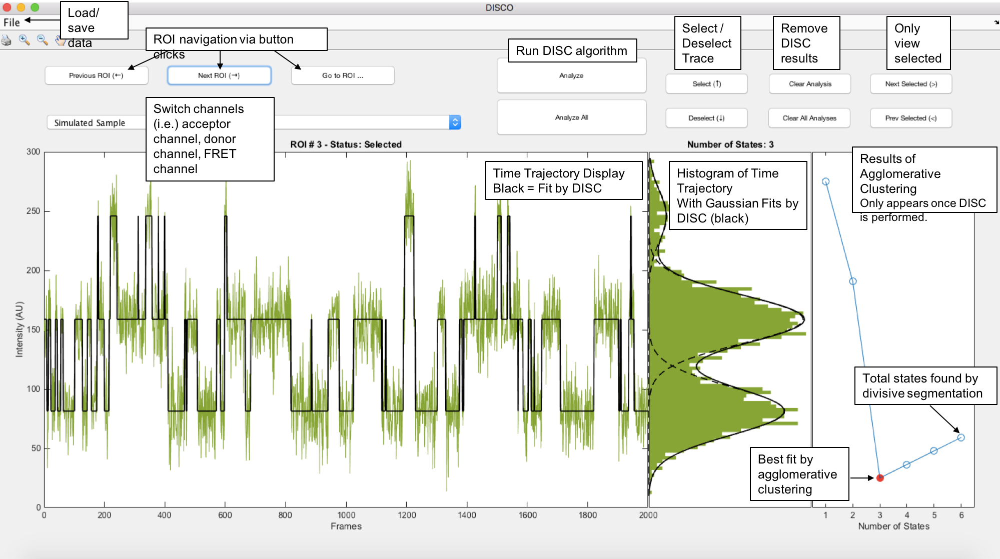
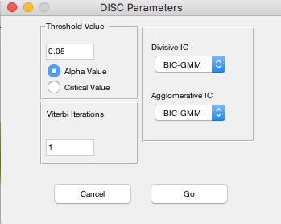

July 2019

v2.0.0

######

*Table of Contents*

* [Introduction](#intro)
* [Getting Started](#getting_started)
	* [Installing DISC](#installation)
	* [Sample Data](#sample_data)
* [Running DISCO](#running_disco)
* [Loading Data](#loading_data)
	* [Importing from .dat](#loading_data_dat)
* [Navigation in DISCO](#navigation_disco)
* [Analyzing Trajectories with DISCO](#analyzing_disco)
	* [Single Trajectory Analysis](#analyzing_disco_single)
	* [Analyzing an Entire Data Set](#analyzing_disco_all)
	* [Clear Analysis](#analyzing_disco_clear)
	* [Trace Selection / Deselection](#analyzing_disco_selection)
	* [Automatic filtering](#analyzing_disco_filtering)
	* [Additional plotting](#analyzing_disco_plotting)
* [Saving Data](#saving)
	* [Exporting to .dat](#saving_export_dat)
	* [Exporting and reimporting selected traces](#saving_export_selected)
	* [Exporting figures](#saving_export_figs)
	* [Exporting dwell analysis](#saving_export_dwell)
* [Data Format](#data_format)
	* [Input Data Format](#data_format_input)
	* [DISCO Output](#data_format_disco_output)
* [Running DISC outside of the GUI](#disc_no_gui)
* [Summary](#summary)

<a id="intro"></a>
## Introduction
                                       
Welcome to DISC! 

DISC (divisive segmentation and clustering) is an open source MATLAB package for time series idealization (i.e. identifying significant states and transitions). We enhance change-point detection algorithms with divisive clustering to accelerate the typical speed of time-trajectory analysis by orders of magnitude while retaining or improving accuracy. We have designed the DISC framework to be a flexible approach, with applications primarily in single-molecule data, such as smFRET and force spectroscopy. 

Please cite "White, D.S., Goldschen-Ohm, M.P., Goldsmith, R.H., Chanda, B.C., "High-Throughput Single-Molecule Analysis via Divisive Segmentation and Clustering"  if using this software. 

To ensure you have the most up-to-date version of DISC (of which this manual should be reflective of), please see https://github.com/ChandaLab/DISC. 
If you'd like to try a version in development, try the `trunk` branch with 
```
$ git checkout trunk
```
from the `DISC` directory. Of course, this version will be more bug-prone.

<a id="getting_started"></a>
## Getting Started

<a id="installation"></a>
### Installing DISC

DISC is written entirely in MATLAB (R2017B and above) and does not require installation beyond obtaining MATLAB. The MATLAB Statistics and Machine Learning Toolbox is required. 

<a id="sample_data"></a>
### Sample Data 

For this guide, we will be using the simulated sample data provided in `sample_data/sample_data.mat`.

<a id="running_disco"></a>
## Running DISCO

DISCO is the name we have given the graphical user interface (GUI) for running the DISC algorithm. 

To open DISCO: 

1. Open MATLAB
2. Add DISC folder to your file path
3. Type DISCO into the Command Window

or right click→`Run` DISCO.m in MATLAB's file viewer. 

DISC can also be [run outside of the GUI](#disc_no_gui) using `DISC_noGUI.m`. 

<a id="loading_data"></a>
## Loading Data 

Once DISCO is executed, it will open a window with a prompt to load a data set. Navigate to `sample_data/` and load `sample_data.mat`. See [input data formats](#data_format_input).

Once a data set is loaded, the GUI will initialize and display the first trajectory (Figure 1). 

<p align="center">
<a></a>

**Figure 1**: DISC GUI Overview
</p>

If DISC is already open and you wish to load a different data set: `File`→`Load Data`

<a id="loading_data_dat"></a>
### Importing from .dat
DISCO is also capable of loading tabular data as in HaMMy or vbFRET.
In this case, each trajectory is a column in the table, with the column header labeling the channel. For multiple traces on a channel, each column corresponding to a trace will have a header with the name of that channel. Examples of this format can be found in `sample_data/sample_data.dat` and `sample_data/sample_data_truncated.dat`. The former contains the same data as `sample_data/sample_data.mat`, and the latter contains the first two ROIs of the two channels of `sample_data/sample_data.mat` for the sake of readability---If you do not have a side-scrolling text editor/viewer, it would probably be a bit tricky to understand the format of the unabridged version.

Data formatted as such via comma-separated values instead of tabs can also be imported. It is expected that Excel formats will also work, but this has yet to be fully implemented or tested. 

See also: how to **[export to this form](#saving_export_dat)**.

<a id="navigation_disco"></a>
## Navigation in DISCO 

Trajectories can be navigated by either arrow clicks in the GUI (e.g. `Next ROI (→)`) or by the keyboard. 

| Key | Function |
| --- | --- |
| Right arrow | Navigate to next trajectory |
| Left arrow | Navigate to previous trajectory |
| Up arrow | Select trajectory |
| Down arrow | Deselect trajectory |
| Period / > | Navigate to next 'selected' trajectory |
| Comma / < | Navigate to previous 'selected' trajectory |


Adding or modifying existing keys can be done in `src_GUI/roiViewerGUI.m` via `figure_main_WindowKeyPressFcn`.

<a id="analyzing_disco"></a>
## Analyzing Trajectories with DISCO

<a></a>

**Figure 2**: DISC Parameters window

<a id="analyzing_disco_single"></a>
### Single Trajectory Analysis

Trajectories can be analyzed either in or individually at once for a given channel. Let's start by analyzing the first trajectory.  
1. Click "Analyze" 
2. Enter your own parameters for the DISC algorithm or use the suggested default values.
3. Click "Go"

The trajectory will be analyzed. Black lines appear on the time-trajectory and the histogram plot showing the fit by DISC. If any agglomerative clustering was performed, an additional plot will appear to the right of the histogram showing the total number of states found and the overall best number of states. 

*Note: Deciding which parameters to use will depend on the sort of data you are analyzing. We will provide better benchmarks as DISC gains more use. For now, it is valuable to try different parameters and see what appears to work best.*

<a id="analyzing_disco_all"></a>
### Analyzing an Entire Data Set

Now let's analyze all 100 traces:

1. Click "Analyze All" 
2. Input the parameters for the DISC algorithm or use the suggested default values
3. Click "Go"

A wait-bar will pop up during this process. Once it closes, the analysis is complete. Should you wish to cancel the idealization at any point, simply click 'Cancel' in the wait-bar window.

*Note: This is our suggested method of use for DISC, as this scheme analyzes all trajectories with the same statistical assumptions, rather than changing confidence intervals or objective functions per trace to get a desired answer.*

<a id="analyzing_disco_clear"></a>
### Clear Analysis

The results of DISC can be removed either per trace using "Clear Analysis" or for every trajectory using "Clear All Analyses". 

<a id="analyzing_disco_selection"></a>
### Trace Selection / Deselection 

Trajectories can be selected by pressing the up arrow or click the "select" button in the GUI. This will add a field to the rois structure (see [input data formats](#data_format_input)) to be indexed by further analysis by DISC. For example, ROI #24 has a low signal-to-noise ratio and you may not be confident in the analysis results, unlike ROI #22 which has a very high signal-to-noise. Therefore, you may want to Select ROI #24 and Unselect ROI #22 for further analysis. 

By default, all traces are "Unselected" (i.e. `data.rois(1,1).status = 0`). Once traces are selected, you can navigated between only the selected traces using "," or "." on the keyboard or by clicking "Next Selected (>)"  or "Prev Selected (<)" in the GUI. 

<a id="analyzing_disco_filtering"></a>
### Automatic filtering
By clicking `Filter by ...`, the traces that have been idealized can be sorted by signal-to-noise ratio, number of identified states, or both. The button will open a graphical dialog from which you can enter minima and/or maxima for either parameter. Leaving a maximum empty will default to infinity, leaving a minimum empty will default to -infinity for SNR and 0 for number of identified states.

See `src_GUI/computeSNR.m` for more info.

Filtering will deselect any currently selected ROIs and select those that satisfy the filter.

<a id="analyzing_disco_plotting"></a>
### Additional plotting
Histograms of SNR, number of identified states, and dwell times can be created via the `Plots` menu. In each case, only idealized traces are accounted for. 

The dwell time histogram will have plots for each state across the entire channel, and each plot will have an ideal (exponential) fit superposed on it. The data from these histograms can be exported, as is optioned in a dialog that opens when the histograms are. See [Exporting dwell analysis](#saving_export_dwell) for more info.

<a id="saving"></a>
## Saving Data 

Simply click `File`→`Save Data`. See [DISCO output](#data_format_disco_output) for information.

<a id="saving_export_dat"></a>
### Exporting to .dat
After analysis, you may wish to export your idealized trajectories. This can be accomplished in the form of relative intensity (`ideal` field of `data.rois`) or relative state index (`class` field of `data.rois`).

To do so, click `File`→`Export Channel to .dat ...`. This will open a dialog, where choose between ideal and class, as well as whether you'd like to export every analyzed trace in the channel or just the ones that have been marked `Selected`.

The resulting `.dat` file will be of the form aforementioned in [Importing from .dat](#loading_data_dat).

<a id="saving_export_selected"></a>
### Exporting (and reimporting) selected traces
Once some amount of traces have been Selected, you may wish to trim the unused traces from the current data set and view only those Selected. 

To do so, click `File`→`Export and Reload Selected ...`. This will open a dialog to save the selected traces into its own `.mat` file (default name `selected.mat`) and automatically reload that file into DISCO.

<a id="saving_export_figs"></a>
### Exporting figures
To easily export the current ROI to a MATLAB figure, click `File`→`Export Figures ...`. This will open a dialog to select which channels you would like to be in the figure. 

The resulting figure will be a series of subplots that will mirror the state of the traces in the GUI. For example, if channels 1 and 2 have been selected to be exported, but only channel 1 has been idealized, the figure will display the trajectory and idealization, histogram, and metric plots of the channel 1 trace, but only the raw trajectory and histogram of the channel 2 trace.

Once the figure is open, you will probably want to `File`→`Save As` etc.

<a id="saving_export_dwell"></a>
### Exporting dwell analysis
After clicking `Plots`→`Dwell Time Analysis`, a dialog will open asking if you'd like to export the dwell analysis data to a .csv file for easy importing into Excel or a similar program. The data will be formatted as such: the first n columns correspond to the n states identified in every trace across the entire channel. Each of these columns will generally have thousands of rows. To the right (beginning at column n + 2) is a 3 x n matrix consisting of exponential fit data: row 1 = mu for each state, rows 2 and 3 = confidence interval for each state. 

<a id="data_format"></a>
## Data Format

<a id="data_format_input"></a>
### Input Data Format

*Notation:
"rois" = regions of interest. 
N = number of data points*

Data is formatted in data structures with the following required fields:

| Variable | Description |
| --- | --- |
| `data` | Data structure to describe the entire<br> data set |
| `data.rois` | Data structure for a specific region of interest (roi) |
| `data.names` | Cell to name the channels (strings) |
| `data.rois.time_series` | Column array (N x 1) of observed time series for the roi to be analyzed by DISC |

For example, in our simulated data there are 100 trajectories each with 2000 data points. Therefore,
```
                 size(data.rois) = [100 2]
size(data.rois(1,1).time_series) = [2000 1]
```
where `data.rois(1,1)` indexes the first trajectory of the first channel 

In our simulated data, we have 2 channels, shown by: 
```
data.names{1} = 'Simulated Sample'
data.names{2} = 'Simulated Sample with True Fits'
```
This allows different trajectories to be collected from the same roi. For example, in smFRET experiments, it is common to collect the emission time-trajectories of the acceptor, the donor, and the calculated FRET efficiency. If data.names is not provided, default channel names will be given. 

Any other fields in either data or rois is acceptable and will not have an effect on DISC. We find this to be a useful format for including information about our data at various levels. For example, in our sample data, we can retain information about how our data was simulated: 

```
>> data

  struct with fields:

                rois: [100x2 struct]
            fcAMP_uM: 1
            Q_matrix: [4x4 double]
     emission_states: [1 1 2 2]
    bound_intensites: [1x1 prob.LognormalDistribution]
     bound_variation: [1x1 prob.ExponentialDistribution]
          duration_s: 200
        frame_rate_s: 0.1000
               names: {'Simulated Sample'  'Simulated Sample with True Fits'}
```
At the data.rois level, we can include information such as DISC fits, signal to noise ratio (SNR), selection status, etc... 

<a id="data_format_disco_output"></a>
### Analysis Output 

`runDISC.m` (which `DISCO` and `DISC_noGUI` call) returns the structure `disc_fit` for each roi in `data.rois`.

For example:
```
>> data.rois(1,1).disc_fit

ans = 

  struct with fields:

    components: [2x3 double]
         ideal: [2000x1 double]
         class: [2000x1 double]
      n_states: 2
       metrics: [2x1 double]
     all_ideal: [2000x2 double]
    parameters: [1x1 struct]
```

where: 

| Field | Description |
| --- | --- |
| `components` | `[weight, mean, standard deviation]` of each identified state |
| `ideal` | `time_series` fit described by the mean value of each state |
| `class` | `time_series` fit described by the integer of unique states |
| `n_states` | number of states identified |
| `metrics` | all computed information criterion (i.e. BIC) values<br> from agglomerative clustering. |
| `all_ideal` | all possible state sequences from the initial results of divisive segmentation and grouped by agglomerative clustering:<br>`all_ideal(:,1)` = 1 state fit; `all_ideal(:,2)` = 2 state fit, etc... |
| `parameters` | all input values used for analysis in DISC (**Figure 2**) |

<a id="disc_no_gui"></a>
## Running DISC outside of the GUI  

We've also provided a script (`DISC_noGUI.m`) to run the algorithm without the DISCO GUI. This is useful if you only want to idealize and perform no further analysis, as DISCO takes quite a bit of memory to render. This script includes data loading and saving, channel select, and a progress display during idealization. Once a channel is selected, every trace on the selected channel will be idealized.

You can alter DISC's statistical parameters at the clearly marked area at the beginning of the file, where: 

| Field | Description |
| --- | --- |
| `input_type` | Either `'alpha_value'` or `'critical_value'` for use in<br>change-point detection. |
| `input_value` | Value corresponding to `input_type`. e.g. 0.05 = 95% confidence interval when used with `'alpha_value'` |
| `divisive` | Information criterion/objective function for identifying states during the divisive phase (see `computeIC.m` for a list of available options). This value determines the max number of states possible for agglomerative clustering. |
| `agglomerative` | Information criterion/ objective function for identifying states during the agglomerative phase (see `computeIC.m` for a list of available options). This value determines the final number of states returned for fitting by Viterbi. |
| `viterbi` | Iterations of the Viterbi algorithm to identify the most likely hidden state sequence. We recommend 1 or 2 iterations. 0 = do not run Viterbi. |
|`return_k` | Force the number of states you want runDISC.m to return. If `return_k` > # states identified, then the # of states identified will be returned. *Note: This is not the suggested use of DISC.* |

<a id="summary"></a>
## Summary

1. Click `File`→`Load Data` 
2. Select data set you would like to load 
3. Click "Analyze All" 
4. Enter the analysis parameters for DISC you would like to use.
5. Click "Go"
6. Check the fits of the data and either "Select" or "Unselect" traces as desired. 
7. If more than one channel is present, switch channels with the drop-down box.
8. Repeat 3-8 as needed.
9. Click `File`→`Save Data`
10. Save the data in the location with the name you want. 
11. DONE!
